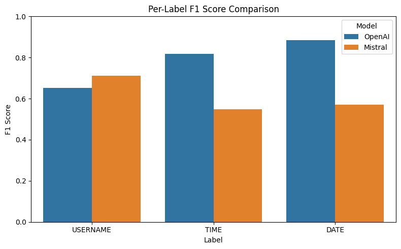

# PII Redaction Project

This project implements a flexible and developer-friendly system for detecting and redacting Personally Identifiable Information (PII) from natural language text. It combines both prompt-based and fine-tuned approaches to balance ease of use with performance:

- A **prompt-based redactor** using OpenAI's API for quick experimentation and zero-shot usage.
- A **fine-tuned Mistral model with LoRA** for high-precision offline redaction.
- A complete **evaluation suite** to measure precision, recall, and F1 — both overall and per PII label.
- A lightweight **command-line interface** and modular code structure for seamless integration into developer pipelines.

The system is designed for developers who need high-quality redaction in practical settings like documents, emails, or transcripts. The training and evaluation pipelines leverage the `ai4privacy/pii-masking-300k` dataset for benchmark comparison and reproducibility.


## Summary of Assumptions 
* PII Types: Default list provided, with full support for user-defined taxonomies.
* Redaction Format: Replace spans with [LABEL] tokens for interpretability; no full removal by default.
* Model Flexibility: Works with OpenAI (cloud) or Mistral fine tuned (local).
* Languages: English-only for now.
* Performance: Supports both streaming (single file) and batch (entire dataset) modes.
* Datasets: Optimized for structured, labeled datasets like ai4privacy. Using 1000 samples from training for fine tuning and 50 samples from validation set for evals.
* Interface: CLI-first design for developer workflows and automation.

## Quickstart (Try It Now)

Run redaction on a text file using OpenAI:
```bash
python pii_redactor.py --input sample.txt --output output.json
```

Run redaction on a text file using Mistral:
```bash
python pii_redactor.py --input sample.txt --output output.json --use-mistral
```

## Fine tuning
* Mistral model is fine tuned using LoRA on a subset of 1000 samples from training set.
* BERT was another possible option but chose 

## Evaluation Results

Evaluated on a 50-sample subset of the `ai4privacy/pii-masking-300k` validation set.

### OpenAI API (`gpt-3.5-turbo`)

**Overall Metrics:**
- **Precision:** 0.8344  
- **Recall:** 0.7975  
- **F1 Score:** 0.8155  

---

### Fine-Tuned Mistral (`mistralai/Mistral-7B-Instruct-v0.2`)

**Overall Metrics:**
- **Precision:** 0.5533  
- **Recall:** 0.5253  
- **F1 Score:** 0.5390  

### Per Label Metrics:



## Limitations

* Current version supports only English text.
* The Mistral model is fine-tuned on a subset of 1000 examples and may underperform on edge cases.
* Redaction assumes labeled [LABEL] placeholders; full removal is not yet supported.
*  OpenAI API usage may incur cost and is rate-limited.
* Tests do not directly test the models.

## Future Improvements & Extensions

### Model Improvements
* Include confidence scores with each redacted entity.
* Longer and better fine tuning of Mistral model.
* Allowing the option to tune for recall or precision.

### Language and Domain Support
* Extend to non-English languages using multilingual datasets.
* Add PII and NER templates and evaluation for specific domains like healthcare, legal, and finance.

### Performance and Deployment
* Add a hybrid mode: use simple rules first, then fall back to the model when needed.
* Allow batch redaction with parallel processing for large datasets.

### Usability
*	Let users control how each PII type is masked (e.g., replace with [NAME] or ***).
*	Add basic regex-based matching as a fallback option.

### Data and Training
* Allow users to correct redaction errors and use those corrections to improve the model over time.

### Evals
* More metrics like F2 score, precision recall curve, confusion matrix, etc.

### Tests
* Add tests for the CLI and the models. 

## Project Structure

- `dataset_create.py`: Script for downloading and preparing the PII masking dataset
- `fine_tuning/pii_mistral_fine_tune.py`: Script for fine-tuning Mistral model for PII detection
- `evals/pii_eval.py`: Evaluation script for PII detection performance
- `pii_redactor.py`: Main script for PII detection and redaction
- `default_pii_types.py`: Configuration file for PII types
- `tests/`: Directory containing test files
- `model_mistral/`: Directory containing fine-tuned Mistral model

## Prerequisites

- Python 3.8 or higher
- pip (Python package manager)
- CUDA-capable GPU (recommended for fine-tuning)

## Installation

1. Clone the repository:
```bash
git clone https://github.com/SND96/pii-redact-assignment
cd pii-redact-assignment
```

2. Install the required dependencies:
```bash
pip install -r requirements.txt
```

3. Set up environment variables:
Create a `.env` file in the root directory with the following variables:
```
OPENAI_API_KEY=your_openai_api_key
```

## Usage

### 1. Dataset Preparation

To download and prepare the PII masking dataset:

```bash
python dataset_create.py
```

This script:
1. Downloads the "ai4privacy/pii-masking-300k" dataset from Hugging Face
2. Creates a `data` directory if it doesn't exist
3. Saves the train and validation splits to disk
4. Prints dataset statistics and a sample row

The dataset contains the following fields:
- `id`: Unique identifier
- `language`: Language of the text
- `set`: Dataset split (train/validation)
- `source_text`: Original text with PII
- `target_text`: Masked text with PII replaced
- `privacy_mask`: PII masking information
- `span_labels`: PII span labels
- `mbert_text_tokens`: Tokenized text for mBERT
- `mbert_bio_labels`: BIO labels for mBERT

### 2. Model Fine-tuning

To fine-tune the Mistral model using LoRA (Low-Rank Adaptation):

```bash
python fine_tuning/pii_mistral_fine_tune.py
```

The script uses the following default configuration:
- Base model: "mistralai/Mistral-7B-Instruct-v0.2"
- Dataset: "ai4privacy/pii-masking-300k"
- Training size: 1000 examples
- LoRA configuration:
  - Rank (r): 8
  - Alpha: 32
  - Dropout: 0.05
  - Target modules: ["q_proj", "v_proj"]
- Training arguments:
  - Batch size: 4
  - Epochs: 3
  - Weight decay: 0.01
  - Save strategy: epoch
  - Evaluation steps: 500

### 3. PII Redaction

To run PII redaction on a text file or directory:

```bash
python pii_redactor.py --input input.txt --output output.json
```

Command line arguments:
- `--input` or `-i`: Input file or directory containing text to redact (required)
- `--output` or `-o`: Output file to save redacted results (required)
- `--use-mistral`: Use local Mistral model instead of OpenAI API
- `--model-path`: Path to the local Mistral model directory (default: "model_mistral")
- `--limit`: Maximum number of examples to process
- `--pii-types-file`: Path to file containing PII types (one per line)
- `--pii-types`: List of PII types to use for redaction

Example using Mistral model:
```bash
python pii_redactor.py --input input.txt --output output.json --use-mistral --model-path model_mistral
```

Example using OpenAI with custom PII types:
```bash
python pii_redactor.py --input input.txt --output output.json --pii-types NAME EMAIL PHONE
```

### 4. Evaluation

To evaluate PII detection performance:

```bash
python evals/pii_eval.py --file pii_redaction_results_val.json
```

Command line arguments:
- `--file`: Path to the JSON file containing redaction results (default: 'pii_redaction_results_val.json')
- `--per-label`: Include per-label metrics in the results
- `--ignore-labels`: Only match spans based on start and end positions, ignoring labels

The evaluation script provides the following metrics:
- Overall metrics:
  - Precision
  - Recall
  - F1 score
- Per-label metrics (when `--per-label` is specified):
  - Precision, Recall, and F1 for each PII type
  - Counts of:
    - True Positives
    - False Positives
    - False Negatives

Example with per-label metrics:
```bash
python evals/pii_eval.py --file output.json --per-label
```

## Testing

Run the test suite:

```bash
python -m pytest tests/
```

## Output Format

The output JSON file contains an array of objects with the following structure:
```json
[
  {
    "original_text": "original text content",
    "redacted_text": "text with PII redacted",
    "pii_entities": [
      {
        "label": "PII_TYPE",
        "value": "original PII value",
        "start": start_index,
        "end": end_index
      }
    ]
  }
]
```

